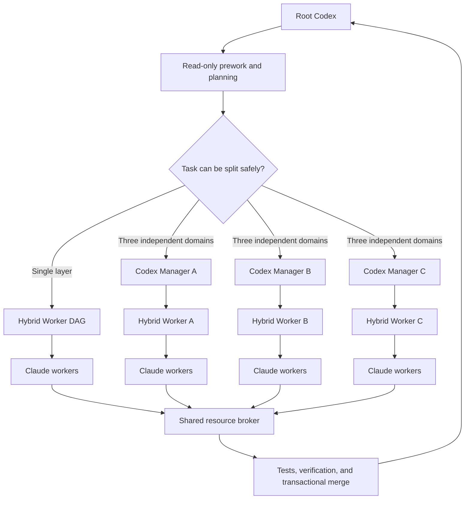

# Hybrid Worker

[English](README.md) | [简体中文](README.zh-CN.md)

[](https://nodejs.org/)
[](LICENSE)

Hybrid Worker is a cost-aware multi-agent execution harness for Codex and Claude Code. It keeps Codex focused on planning, task decomposition, orchestration, and final integration, while Claude workers handle implementation, focused testing, self-review, and repair.

The project began as a way to route implementation work through more cost-efficient models available via Claude Code. For workloads that split cleanly, this design can reduce Codex token usage by approximately **40%-90% while preserving comparable delivery quality**. Actual savings depend on task shape and model routing; deterministic gates, independent verification, and transactional merges protect the quality bar.

## How It Works

Hybrid Worker uses one workflow with adaptive orchestration. Small and medium tasks stay in a single layer. Large tasks that can be divided into three independent domains use a second layer of Codex managers, allowing Claude worker calls to scale beyond Codex's four concurrent agent slots without allowing uncontrolled writes to the same repository.



The two-layer path is enabled only when deterministic checks find at least 12 required write nodes, exactly three low-overlap workstreams, at least three implementation nodes per workstream, no cross-domain write overlap or implementation dependency, a unique owner for shared files, and complete final verification commands. Otherwise, execution remains in a single dynamic DAG.

## Core Mechanisms

- **Plan before execution:** Codex defines the objective, path ownership, dependencies, risk floor, and an allowlisted command catalog. Read-only scouts fill evidence gaps before the workflow is compiled.
- **Route by difficulty:** fast classification and scouting use Haiku, normal implementation and verification use Sonnet, and high-risk work, repair, and critical verification use Opus. Risk floors cannot be downgraded by the planner.
- **Isolate every writer:** each implementation node runs on its own Git branch and worktree. Managers also receive unique branches, worktrees, and run directories.
- **Verify independently:** the harness checks paths, diffs, generated artifacts, and tests. Medium- and high-risk work adds independent verification; critical work requires a two-of-three deep-verifier quorum.
- **Bound cost and concurrency:** all managers share one lease-based broker instead of receiving separate quotas. Pilot batches validate homogeneous work before broader execution, and low pass rates trigger a circuit breaker.
- **Merge transactionally:** worker changes merge into integration branches first. The original branch is fast-forwarded only after every required node and final verification pass. Successful branches and checkpoints remain reusable after a failure.

Implementers do not approve their own work. A failed verification may trigger at most one deep repair, followed by a complete test and verification rerun.

## Default Limits

| Resource | Default |
| --- | ---: |
| Read-only Claude agents | 8 |
| Writing Claude workers | 4 |
| Claude agent calls | 64 |
| Observable cost ceiling | USD 10 |
| Nodes per batch | 4 |
| Circuit-breaker pass rate | 2/3 |

The broker applies these limits globally across every manager process and reclaims expired leases after abnormal exits.

## Quick Start

Requirements: Node.js 22+, Git 2.x, and the Claude Code CLI.

Install as a Codex skill:

```bash
git clone git@github.com:LeeJc02/Hybrid-Worker.git ~/.codex/skills/hybrid-worker
cd ~/.codex/skills/hybrid-worker
npm ci
npm run build
npm run doctor
```

Define the objective, risk floor, and allowed verification commands in `workflow_seed.json`:

```json
{
  "version": 2,
  "objective": "Implement the requested change",
  "command_catalog": {
    "check": { "argv": ["npm", "run", "check"] }
  },
  "final_verification": ["check"]
}
```

Compile and validate the workflow before starting any writing worker:

```bash
node ~/.codex/skills/hybrid-worker/dist/src/cli.js \
  --repo /path/to/target-repo \
  --task-file TASK.md \
  --workflow-seed workflow_seed.json \
  --workflow-plan-only
```

The report selects the execution shape and provides the commands to run. Root Codex launches one hybrid-worker process for a single-layer graph, or exactly three generated manager commands for a hierarchical graph. After all managers succeed, finalize the parent transaction:

```bash
node ~/.codex/skills/hybrid-worker/dist/src/cli.js \
  --finalize-parent-run /path/to/parent-run
```

The compiled workflow may reference only commands authorized by the seed. Model-generated JavaScript and unapproved bare shell commands are rejected.

## Development

```bash
npm ci
npm run dev -- --doctor
npm run build
npm test
npm run check
npm run verify
```

Tests use Vitest and fake agents, so automated verification does not incur live Claude model costs.

```text
src/       CLI, workflow, broker, worker, Git, and reporting code
tests/     Unit and fake-agent integration tests
schemas/   Workflow, worker, and report JSON Schemas
docs/      Architecture and compatibility notes
agents/    Codex skill metadata
SKILL.md   Codex integration contract
```

See [Architecture](docs/ARCHITECTURE.md) for the detailed design and [Parity](docs/PARITY.md) for compatibility and test coverage.

## Version History

- **v1:** introduced single-layer worker plans, isolated worktrees, deterministic gates, and transactional merging.
- **v2:** added declarative dynamic DAGs, hierarchical managers, a global resource broker, independent verification, circuit breaking, and resumable execution.

These labels describe project history only. The current project exposes one adaptive Hybrid Worker workflow.

## License

Released under the [MIT License](LICENSE).
