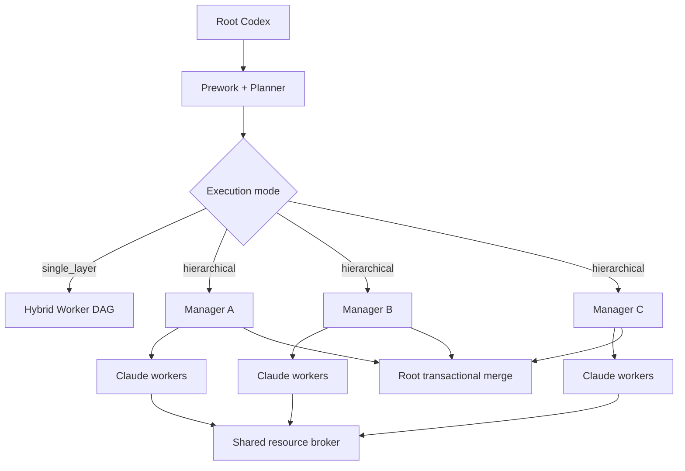

# Hybrid Worker

Hybrid Worker 是一个面向 Codex 与 Claude Code 的 TypeScript 多智能体执行框架。Codex 负责规划、分层编排与最终集成，Claude workers 在隔离的 Git worktree 中实现任务；harness 统一执行路径、测试、验证、资源预算和事务合并门禁。

[](https://github.com/LeeJc02/Hybrid-Worker)
[](https://nodejs.org/)
[](LICENSE)

## 核心能力

- 保留 v1 `worker_plan.json`、隔离 worktree、确定性门禁和事务合并流程。
- v2 使用声明式 JSON DAG，支持依赖、结构化引用、受限 `when`、`for_each` 和逐项验证。
- 根据确定性规模规则选择单层执行或三个 manager 的分层执行。
- 所有 manager 共享跨进程资源 broker，统一限制并发、调用次数和可观测成本。
- implementer 不自签审核结果，由 harness 发起独立 verifier 投票。
- 同质任务采用 pilot 和分批执行，低通过率或无测试时自动熔断。
- 任一 manager 失败时保持基础分支不变，并保留成功分支用于恢复。

## 工作方式



分层模式只会在以下条件全部满足时启用：

- 至少 12 个 required 写入节点。
- 恰好三个低重叠 workstream。
- 每个 workstream 至少三个 implementer。
- 不存在跨域写路径重叠或跨域实现依赖。
- 共享契约已经冻结并具有唯一 owner。
- 最终验证命令完整。

不满足条件时自动降级为 `single_layer` 或 `single_layer_dynamic_dag`。

## 环境要求

- Node.js 22 或更高版本。
- Git 2.x。
- Claude Code CLI，用于真实 worker、scout、planner 和 verifier 调用。
- 可选 Python 环境，用于目标仓库的测试与 JSON 验证。

## 安装

```bash
git clone git@github.com:LeeJc02/Hybrid-Worker.git
cd Hybrid-Worker
npm ci
npm run build
npm run doctor
```

作为 Codex skill 使用时，可以直接克隆到 Codex skills 目录：

```bash
git clone git@github.com:LeeJc02/Hybrid-Worker.git ~/.codex/skills/hybrid-worker
cd ~/.codex/skills/hybrid-worker
npm ci
npm run build
```

## v1 快速开始

准备 `TASK.md`、worker ticket 和 `worker_plan.json`：

```bash
node dist/src/cli.js \
  --repo /path/to/target-repo \
  --task-file TASK.md \
  --plan-file worker_plan.json \
  --dry-run
```

预检通过后执行并合并：

```bash
node dist/src/cli.js \
  --repo /path/to/target-repo \
  --task-file TASK.md \
  --plan-file worker_plan.json \
  --merge
```

## v2 快速开始

`workflow_seed.json` 定义目标、风险下限和唯一允许执行的命令目录：

```json
{
  "version": 2,
  "objective": "Implement the requested change",
  "command_catalog": {
    "check": { "argv": ["npm", "run", "check"] }
  },
  "final_verification": ["check"]
}
```

从 seed 启动只读 prework、scouts 和 planner：

```bash
node dist/src/cli.js \
  --repo /path/to/target-repo \
  --task-file TASK.md \
  --workflow-seed workflow_seed.json \
  --workflow-plan-only
```

报告中的 `execution_mode` 决定下一步：

- `single_layer`：由 Root Codex 启动一个 hybrid-worker。
- `single_layer_dynamic_dag`：由 Root Codex 启动一个动态 DAG。
- `hierarchical`：Root Codex 才能启动报告中生成的三个 manager 命令。

三个 manager 全部成功后执行最终事务合并：

```bash
node dist/src/cli.js --finalize-parent-run /path/to/parent-run
```

## 默认资源与验证策略

| 项目 | 默认值 |
| --- | ---: |
| 只读 Claude agents | 8 |
| 写入 Claude workers | 4 |
| Claude agent 调用上限 | 64 |
| 可观测成本上限 | 10 USD |
| 单批节点数 | 4 |
| 熔断通过率 | 2/3 |

模型路由：

- `fast` 使用 Haiku，负责分类和 scouts。
- `balanced` 使用 Sonnet，负责普通实现和验证。
- `deep` 使用 Opus，负责高风险节点、repair 和关键验证。

验证级别：

- `low`：确定性路径、diff、生成物和测试门禁。
- `medium`：增加一个 balanced verifier。
- `high`：增加一个 deep verifier。
- `critical`：三个 deep verifier，至少两票通过。
- 验证失败最多运行一次 deep repair，然后完整重跑测试和验证。

## 安全边界

- 每个写入节点使用独立 branch 和 worktree。
- 基础仓库在最终验证通过前不会被 fast-forward。
- planner 只能引用 seed `command_catalog` 中的命令，不能生成新的裸 shell 或 JavaScript。
- allowed paths、forbidden paths、diff 大小、生成物、测试和 base repo 污染均由 harness 门禁检查。
- 资源 broker 使用跨进程锁、租约续期、原子状态写入和过期租约回收。
- credentials、模型日志、运行产物、缓存和 `node_modules` 不应提交到仓库。

## 开发

```bash
npm ci
npm run dev -- --doctor
npm run build
npm test
npm run check
npm run verify
```

测试使用 Vitest 和 fake agents，不会在自动化测试中产生真实 Claude 调用费用。

项目结构：

```text
src/       CLI、DAG、broker、worker、Git 与报告实现
tests/     单元测试和 fake-agent 集成测试
schemas/   seed、compiled workflow、worker 与 report JSON Schema
docs/      架构和兼容性说明
agents/    Codex skill UI 元数据
SKILL.md   Codex hybrid-worker 行为契约
```

详细设计参见 [架构说明](docs/ARCHITECTURE.md)，兼容与测试矩阵参见 [PARITY](docs/PARITY.md)。

## 版本历史

- v1：单层 worker plan、隔离 worktree、确定性门禁与事务合并。
- v2：动态 DAG、分层 managers、全局 broker、独立 verifier、熔断和断点恢复。

## License

本项目基于 [MIT License](LICENSE) 发布。
