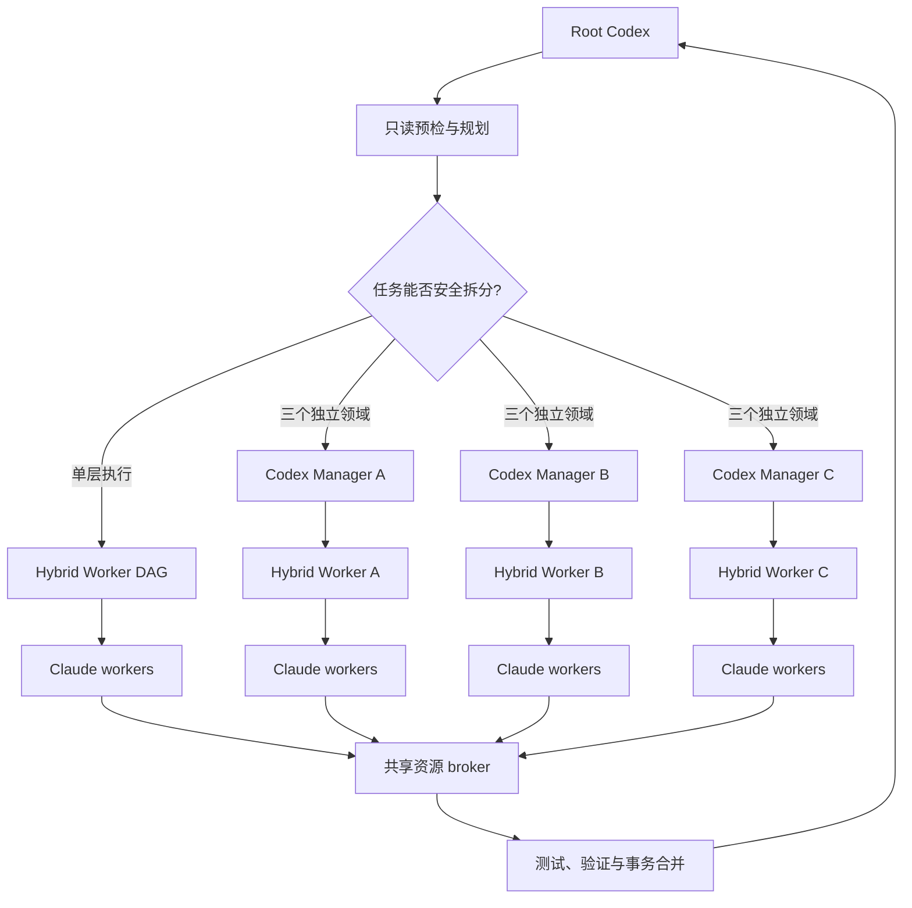

# Hybrid Worker

[English](README.md) | [简体中文](README.zh-CN.md)

[](https://nodejs.org/)
[](LICENSE)

Hybrid Worker 是一个面向 Codex 与 Claude Code 的成本感知型多智能体执行框架。Codex 专注于规划、任务拆分、流程编排和最终集成，Claude workers 则负责具体实现、针对性测试、自检与修复。

这个项目最初是为了通过 Claude Code 接入成本更低的模型，将高 token 消耗的实现工作从 Codex 转移给 Claude workers。对于适合拆分的任务，该架构通常可在**近似保持交付质量的前提下，将 Codex token 消耗降低约 40%～90%**。实际节省取决于任务结构与模型路由，质量则由确定性门禁、独立验证和事务合并机制保障。

## 工作原理

Hybrid Worker 使用一套能够自适应编排的工作流。中小型任务保持单层执行；只有可以安全拆分为三个独立领域的大型任务才启用第二层 Codex managers。这样既能突破 Codex 最多四个 agent 并发槽的限制，又能避免多个写入者不受控制地修改同一个仓库。



分层路径只会在确定性检查同时确认以下条件时启用：至少 12 个 required 写入节点、恰好三个低重叠 workstream、每个 workstream 至少三个实现节点、没有跨域写路径重叠或实现依赖、共享文件具有唯一 owner，并且最终验证命令完整。其他情况均保持在单层动态 DAG 中执行。

## 核心机制

- **先规划再执行：** Codex 定义目标、路径所有权、依赖关系、风险下限和命令白名单；只读 scouts 在编译工作流前补齐缺失信息。
- **按难度路由模型：** Haiku 负责快速分类与侦察，Sonnet 负责常规实现和验证，Opus 负责高风险任务、修复及关键验证；planner 不能降低既定风险下限。
- **隔离所有写入者：** 每个实现节点都在独立 Git branch 和 worktree 中运行，manager 同样拥有唯一的 branch、worktree 和 run directory。
- **独立验证质量：** harness 检查路径、diff、生成物和测试。中高风险任务增加独立 verifier；critical 任务需要三个 deep verifier 中至少两票通过。
- **统一约束成本与并发：** 所有 manager 共享一个带租约的 broker，而不是分别获得完整配额。同质任务先运行 pilot，再分批扩展；通过率过低时自动熔断。
- **事务化合并：** worker 变更先合入 integration branch，只有所有 required 节点和最终验证全部通过后，原始分支才会 fast-forward。失败后仍可复用已成功的分支和 checkpoint。

Implementer 不能为自己的工作签署审核通过。验证失败时最多执行一次 deep repair，随后完整重跑测试和验证。

## 默认限制

| 资源 | 默认值 |
| --- | ---: |
| 只读 Claude agents | 8 |
| 写入 Claude workers | 4 |
| Claude agent 调用数 | 64 |
| 可观测成本上限 | 10 USD |
| 单批节点数 | 4 |
| 熔断通过率 | 2/3 |

Broker 在所有 manager 进程之间统一执行这些限制，并在进程异常退出后自动回收过期租约。

## 快速开始

环境要求：Node.js 22+、Git 2.x 和 Claude Code CLI。

作为 Codex skill 安装：

```bash
git clone git@github.com:LeeJc02/Hybrid-Worker.git ~/.codex/skills/hybrid-worker
cd ~/.codex/skills/hybrid-worker
npm ci
npm run build
npm run doctor
```

在 `workflow_seed.json` 中定义目标、风险下限和允许使用的验证命令：

```json
{
  "version": 2,
  "objective": "Implement the requested change",
  "command_catalog": {
    "check": { "argv": ["npm", "run", "check"] }
  },
  "final_verification": ["check"]
}
```

在启动任何写入 worker 前编译并验证工作流：

```bash
node ~/.codex/skills/hybrid-worker/dist/src/cli.js \
  --repo /path/to/target-repo \
  --task-file TASK.md \
  --workflow-seed workflow_seed.json \
  --workflow-plan-only
```

报告会选择执行形态并生成后续命令。单层图由 Root Codex 启动一个 hybrid-worker 进程；分层图则只能启动报告生成的三个 manager 命令。所有 manager 成功后，执行父级事务合并：

```bash
node ~/.codex/skills/hybrid-worker/dist/src/cli.js \
  --finalize-parent-run /path/to/parent-run
```

编译后的工作流只能引用 seed 已授权的命令。模型生成的 JavaScript 和未经许可的裸 shell 命令会被拒绝。

## 开发

```bash
npm ci
npm run dev -- --doctor
npm run build
npm test
npm run check
npm run verify
```

测试使用 Vitest 和 fake agents，自动化验证不会产生真实 Claude 模型费用。

```text
src/       CLI、工作流、broker、worker、Git 与报告实现
tests/     单元测试和 fake-agent 集成测试
schemas/   工作流、worker 与 report JSON Schema
docs/      架构和兼容性说明
agents/    Codex skill 元数据
SKILL.md   Codex 集成契约
```

详细设计参见[架构说明](docs/ARCHITECTURE.md)，兼容性和测试覆盖参见 [Parity](docs/PARITY.md)。

## 版本历史

- **v1：** 建立单层 worker plan、隔离 worktree、确定性门禁和事务合并流程。
- **v2：** 增加声明式动态 DAG、分层 managers、全局资源 broker、独立验证、熔断和断点恢复。

这些标签仅用于记录项目演进。当前项目只对外提供一套自适应 Hybrid Worker 工作流。

## License

本项目基于 [MIT License](LICENSE) 发布。
